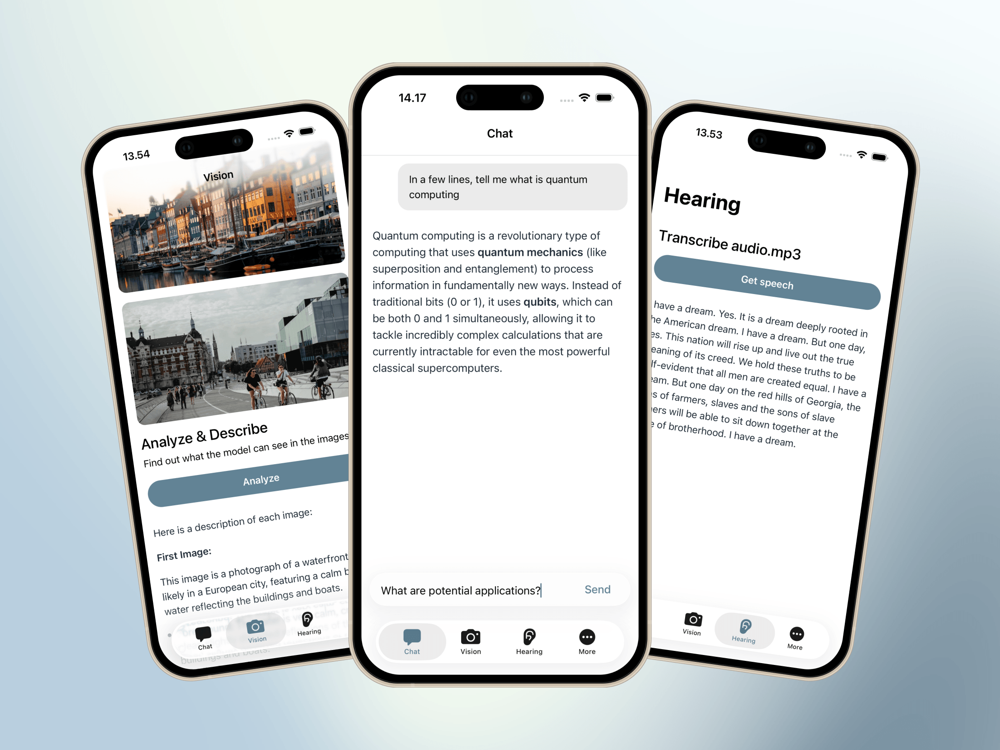

[](https://discord.gg/qhaMc2qCYB)
[](https://matrix.to/#/#nobodywho:matrix.org)
[](https://mastodon.gamedev.place/@nobodywho)
[](https://docs.nobodywho.ooo)

# NobodyWho React Native Starter App

This starter app demonstrates the capabilities of **[NobodyWho](https://github.com/nobodywho-ooo/nobodywho)**, a library designed to run LLMs locally and efficiently on any device.

## Features

- **Chat** — stream responses from a local LLM
- **Tool calling** — give the model access to custom functions (e.g. weather, calculator)
- **Vision & Hearing** — image & audio ingestion with a multimodal model
- **Embeddings & RAG** — semantic search with an embedding model and cross-encoder reranker
- **Speech to Text** - transcribe audio into text
- **Text to Speech** - generate natural-sounding speech from text

## 1. Getting Started

First, you will need to run `npm install` to install dependencies.

For iOS, install pods `cd ios && pod install && cd ..`

### 2. Download Models

In production, we recommend downloading models on demand — only when needed — using a library like `@dr.pogodin/react-native-fs` for advanced options, or our built-in download method. This keeps your app size small. For development, the simplest approach is to download the models ahead of time and bundle them directly in your assets folder (see script below).

#### Automated (Recommended)

**Chat only**
Minimal setup - fast inference, even on old/budget phone.

| Platform      | Command                       |
| ------------- | ----------------------------- |
| macOS / Linux | `./scripts/download_chat.sh`  |
| Windows       | `.\scripts\download_chat.ps1` |

**All features**
Chat + vision + hearing + embeddings + reranker
Downloads Gemma 4, which runs well on flagship phone, but might not work or be slow on old/budget phone

| Platform      | Command                                                                           |
| ------------- | --------------------------------------------------------------------------------- |
| macOS / Linux | `./scripts/download_chat_multimodal.sh && ./scripts/download_embedding_rerank.sh` |
| Windows       | `.\scripts\download_chat_multimodal.ps1; .\scripts\download_embedding_rerank.ps1` |

The scripts download models from Hugging Face, rename them, and place them in the `assets/` folder.

#### Download with NobodyWho

Load models directly from Hugging Face using `hf://` URLs (e.g. `hf://owner/repo/model.gguf`). Also supports plain HTTP/HTTPS URLs. Models are cached locally and re-used on subsequent loads. Works on Android with proper cache directory selection.

Example:

```dart
// Download from HuggingFace (cached automatically)
const model = await Model.load({
  modelPath: "hf://NobodyWho/Qwen_Qwen3-0.6B-GGUF/Qwen_Qwen3-0.6B-Q4_K_M.gguf",
});
```

#### Manual Download

You can use any `.gguf` model from [Hugging Face](https://huggingface.co/models).

**Chat models** — some worth considering: Qwen, Gemma, LFM, and Ministral, available in [this collection](https://huggingface.co/unsloth/collections).

**Multimodal models** — some examples by modality: [Vision](https://huggingface.co/LiquidAI/LFM2-VL-450M-GGUF/tree/main), [Hearing](https://huggingface.co/ggml-org/ultravox-v0_5-llama-3_2-1b-GGUF/tree/main), [Vision + Hearing](https://huggingface.co/unsloth/gemma-4-E2B-it-GGUF/tree/main)

Compatibility notes:

- Most GGUF models will work, but some may fail due to formatting issues. Here are some [models](https://huggingface.co/NobodyWho/collections) we have made sure they work perfectly.
- For mobile devices, models under 1 GB tend to run smoothly. As a general rule, the device should have at least twice the available RAM as the model file size. Note that available RAM differs from total RAM — iOS typically reserves around 1–2 GB for the kernel and system processes, while Android overhead varies by manufacturer: roughly 2 GB on stock Android (e.g. Pixel devices), and between 2–4 GB on Samsung, Xiaomi, and Oppo devices due to additional services.

### 3. Run the App

```sh
# Android
npm run android

# iOS
npm run iOS
```

**Note:** For iOS, if you have issues with metro, run `npm start` and then run the project on Xcode.

#### Miscellaneous

iOS cleanup

```sh
make ios-clean
```

Watchman cleanup

```sh
make clean
```

---

## Feedback & Contributions

We welcome your feedback and ideas!

- **Bug Reports & Improvements**: Open an issue on the **[Issues](https://github.com/nobodywho-ooo/react-native-starter-example/issues)** page.
- **Feature Requests & Questions**: Join the discussion on **[Discussions](https://github.com/nobodywho-ooo/react-native-starter-example/discussions)**.
